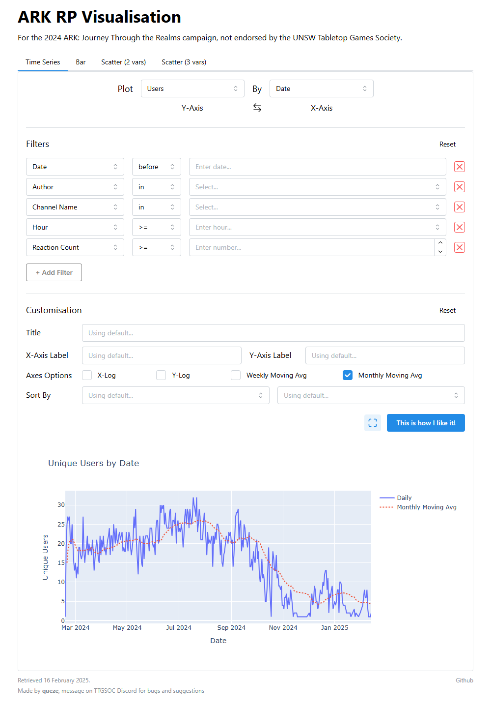
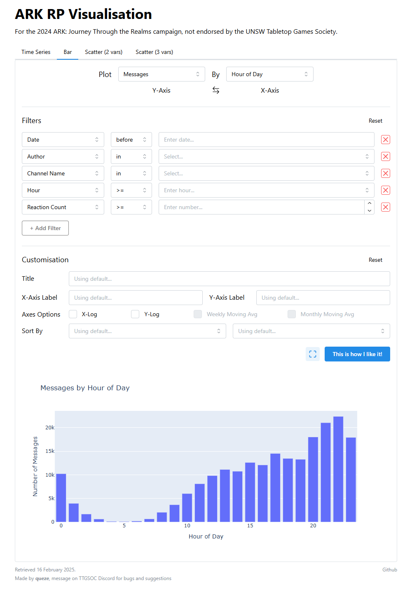
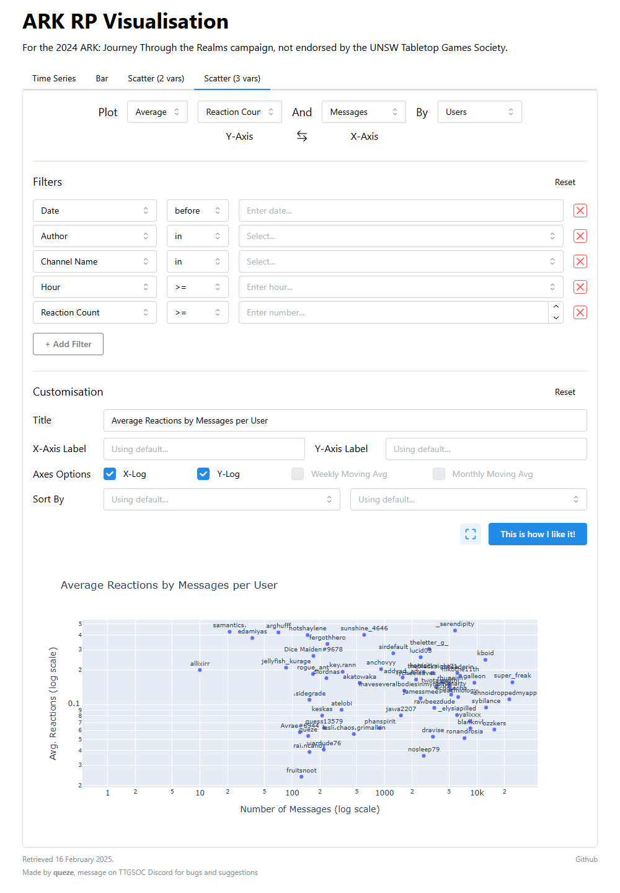

# ARK RP Visualisation
> *This project is unofficial and not endorsed by the UNSW Tabletop Games Society.*

A dashboard for analysing Discord message metadata from the *ARK: Journey Through the Realms* (2024) Dungeons and Dragons campaign.

Screenshots

 

|                               Time Series                            |                               Bar                          |                               Scatter                      | 
| :------------------------------------------------------------------- | :--------------------------------------------------------: | :--------------------------------------------------------: |
|  |  |  |

## Getting Started

### Prerequisites
TODO

### Installation
1. `pip install -r requirements.txt`
2. Create a `.env` with your S3 credentials.
3. `python src/app.py`

## Usage
TODO

## Roadmap
- [ ] Add tooltips & help icons
- [ ] Add demo site
- [ ] Add GIF of usage
- [ ] Add preset graphs to website

## License

This project is licensed under the **MIT license**.

See [LICENSE](LICENSE) for more information.

<!-- MARKDOWN LINKS & IMAGES -->
[Dash-badge]: https://img.shields.io/badge/dash-008DE4.svg?style=for-the-badge&logo=plotly&logoColor=white
[Dash-url]: https://dash.plotly.com/
[Plotly-badge]: https://img.shields.io/badge/plotly-7A76FF.svg?style=for-the-badge&logo=plotly&logoColor=white
[Plotly-url]: https://plotly.com/python/
[Pandas-badge]: https://img.shields.io/badge/Pandas-150458?style=for-the-badge&logo=pandas&logoColor=white
[Pandas-url]: https://pandas.pydata.org/
[DMC-badge]: https://img.shields.io/badge/Dash_Mantine_Components-339af0?style=for-the-badge&logo=mantine&logoColor=white
[DMC-url]: https://www.dash-mantine-components.com/
[Boto3-badge]: https://img.shields.io/badge/boto3-%23FF9900.svg?style=for-the-badge&logoColor=white
[Boto3-url]: https://aws.amazon.com/s3/
[Docker-badge]: https://img.shields.io/badge/docker-%230db7ed.svg?style=for-the-badge&logo=docker&logoColor=white
[Docker-url]: https://www.docker.com/
